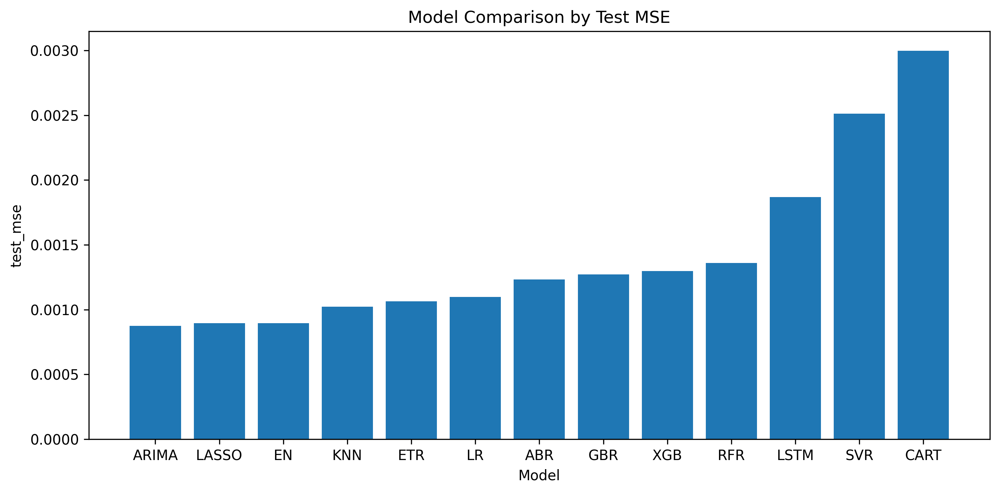
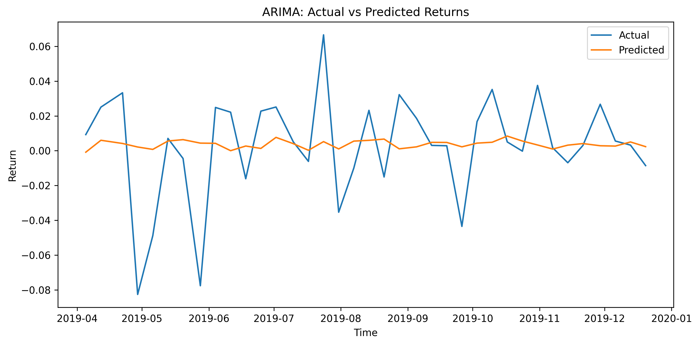
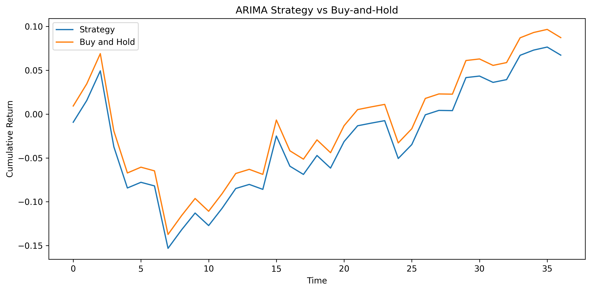

# Financial Time Series Forecasting

### Predicting Microsoft (MSFT) Returns using ML, ARIMA, and LSTM

---

## Overview

This project builds an end-to-end pipeline to forecast **future 5-day returns of Microsoft (MSFT)** using:

* classical machine learning models
* ARIMA with exogenous variables
* LSTM (deep learning baseline)

The goal is not only to minimize prediction error, but also to understand:

* how different model families behave on financial time-series data
* whether complex models actually outperform simpler ones
* whether predictions carry any directional or practical value

---

## Key Results

| Model             | Test MSE     | Directional Accuracy |
| ----------------- | ------------ | -------------------- |
| **ARIMA**         | **0.000875** | 0.622                |
| **LASSO**         | 0.000896     | **0.649**            |
| Elastic Net       | 0.000896     | **0.649**            |
| KNN               | 0.001022     | 0.514                |
| Extra Trees       | 0.001063     | 0.514                |
| Linear Regression | 0.001097     | 0.432                |
| AdaBoost          | 0.001232     | 0.432                |
| Gradient Boosting | 0.001272     | 0.459                |
| XGBoost           | 0.001298     | 0.378                |
| Random Forest     | 0.001360     | 0.378                |
| LSTM              | 0.001869     | 0.438                |
| SVR               | 0.002512     | 0.351                |
| Decision Tree     | 0.002997     | 0.595                |

---

## Visual Results

### Model Comparison (Test MSE)



> ARIMA achieves the lowest prediction error, while LASSO and Elastic Net remain very competitive.

---

### ARIMA: Actual vs Predicted Returns



> The ARIMA model captures directional movement reasonably well, although predictions remain noisy due to the nature of financial returns.

---

### Strategy Backtest (ARIMA)



> A simple long/short strategy based on predicted returns shows improvement over buy-and-hold, indicating some directional usefulness.

---

## Key Insights

* **ARIMA performs best in terms of prediction error**, despite being a relatively simple model
* **Regularized linear models (LASSO / Elastic Net)** perform strongly and generalize well
* **LSTM underperforms**, likely due to small dataset size and noisy signals
* More complex models do not necessarily lead to better results in financial forecasting
* Directional accuracy provides additional insight beyond regression metrics

---

## Project Structure

```bash
Financial-Time-Series-Forecasting/
│
├── run_all.py
├── README.md
├── requirements.txt
├── .gitignore
├── LICENSE
│
├── data/
│   └── msft_dataset.csv
│
├── notebooks/
│   ├── 01_eda.ipynb
│   ├── 02_modelling.ipynb
│   └── 03_evaluation.ipynb
│
├── outputs/
│   ├── figures/
│   │   ├── model_comparison_mse.png
│   │   ├── arima_actual_vs_pred.png
│   │   └── arima_backtest.png
│   │
│   └── results/
│       ├── ml_model_results.csv
│       ├── arima_results.csv
│       ├── arima_predictions.csv
│       ├── lstm_results.csv
│       ├── lstm_predictions.csv
│       └── final_model_comparison.csv
│
├── reports/
│   ├── Financial Time Series Forecasting.pdf
│   └── Financial Time Series Forecasting.pptx
│
├── src/
│   ├── data/
│   │   ├── build_features.py
│   │   └── load_data.py
│   │
│   ├── models/
│   │   ├── train_ml_models.py
│   │   ├── train_arima.py
│   │   └── train_lstm.py
│   │
│   ├── evaluation/
│   │   ├── metrics.py
│   │   └── backtest.py
│   │
│   └── utils/
│       ├── config.py
│       └── plotting.py
```

---

## Dataset

The dataset is constructed from multiple financial and macroeconomic sources:

* Stocks: MSFT, GOOGL, IBM
* Indices: S&P 500, DJIA, VIX
* Currencies: USD/JPY, USD/GBP
* Commodities: Gold, Oil
* Bitcoin
* Treasury yields

### Feature Types

* lagged returns across multiple horizons
* technical indicators (RSI, MACD, Bollinger Bands, ATR, ROC)
* macroeconomic features
* rolling beta (market sensitivity)

### Target

* **Future 5-day log return of MSFT**

---

## Models Used

### Machine Learning

* Linear Regression
* LASSO
* Elastic Net
* KNN
* Decision Tree
* SVR
* Random Forest
* Extra Trees
* Gradient Boosting
* AdaBoost
* XGBoost

### Time Series

* ARIMA with exogenous variables

### Deep Learning

* LSTM (single-layer, small architecture)

---

## Evaluation Metrics

* Mean Squared Error (MSE)
* Root Mean Squared Error (RMSE)
* Mean Absolute Error (MAE)
* Directional Accuracy

Additionally, a simple backtest evaluates:

* strategy returns (long/short based on predictions)
* Sharpe ratio
* maximum drawdown

---

## How to Run

### 1. Install dependencies

```bash
pip install -r requirements.txt
```

---

### 2. Run full pipeline

```bash
python run_all.py
```

This will:

* build the dataset
* train all models
* save predictions and results
* generate the final comparison

---

### 3. Explore notebooks

* `01_eda.ipynb` → data exploration
* `02_modelling.ipynb` → model training
* `03_evaluation.ipynb` → evaluation & backtesting

---

## Limitations

* relatively small dataset (~184 samples)
* no transaction costs or slippage in backtesting
* minimal hyperparameter tuning
* simple LSTM architecture

---

## Conclusion

This project demonstrates that:

* simpler models can outperform more complex ones in financial forecasting
* deep learning is not always beneficial for small, noisy datasets
* evaluating models using only error metrics is insufficient without directional analysis

---

## Future Improvements

* hyperparameter tuning
* larger dataset / longer time horizon
* more realistic backtesting (costs, slippage)
* feature selection and dimensionality reduction
* more advanced sequence models

---

## Author

Sohen Patel

---
